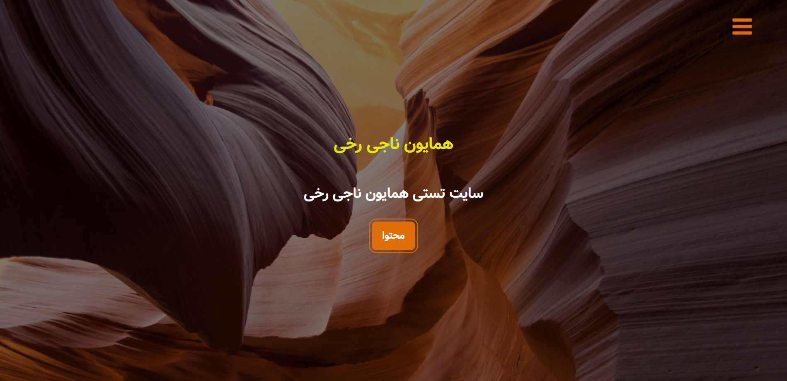
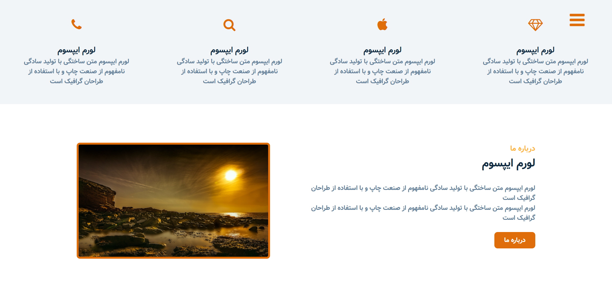
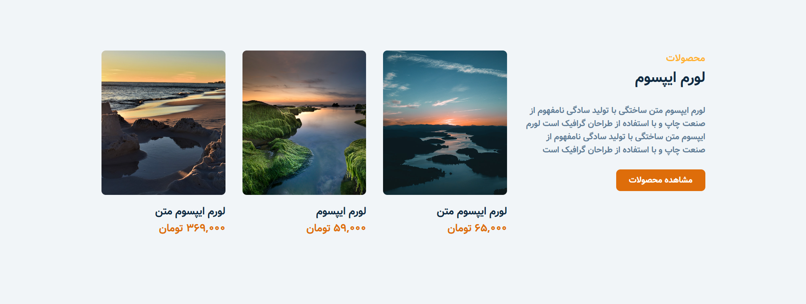
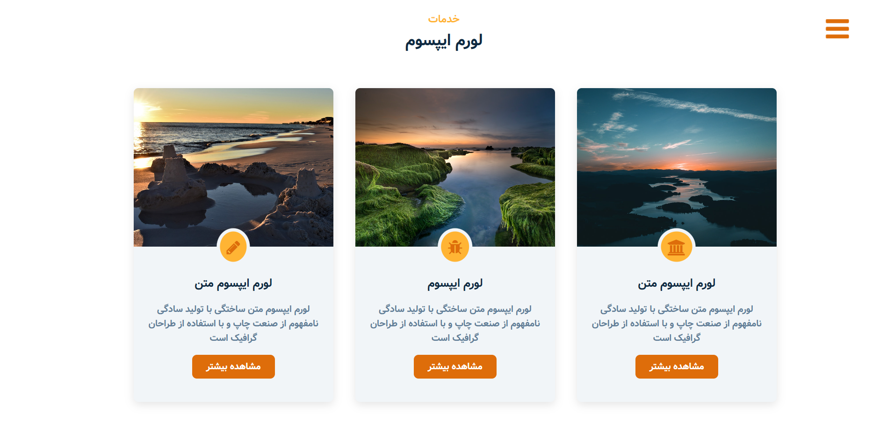
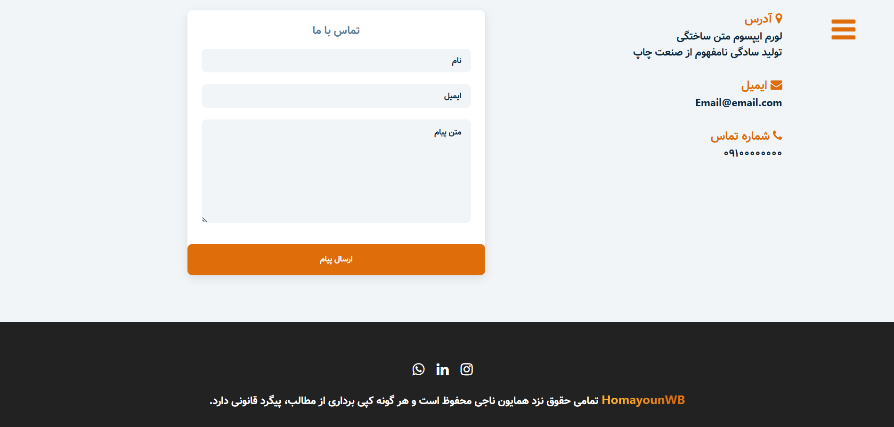

# Homayoun Store Template

This is my first project that I implemented it by pure HTML, CSS and JavaScript :)

__it has 5 pages and it is responsive!__

## Screenshots

## Features

-    Responsive
-    Animations
-    Navigation menu
-    Search Bar
-    Cart
-    and more

## How to use

1.  Download or clone the repository
2.  Go to the directory
3.  Open index.html with your browser

## Developer

[Homayoun Naji](https://github.com/Homayoun-Naji)
